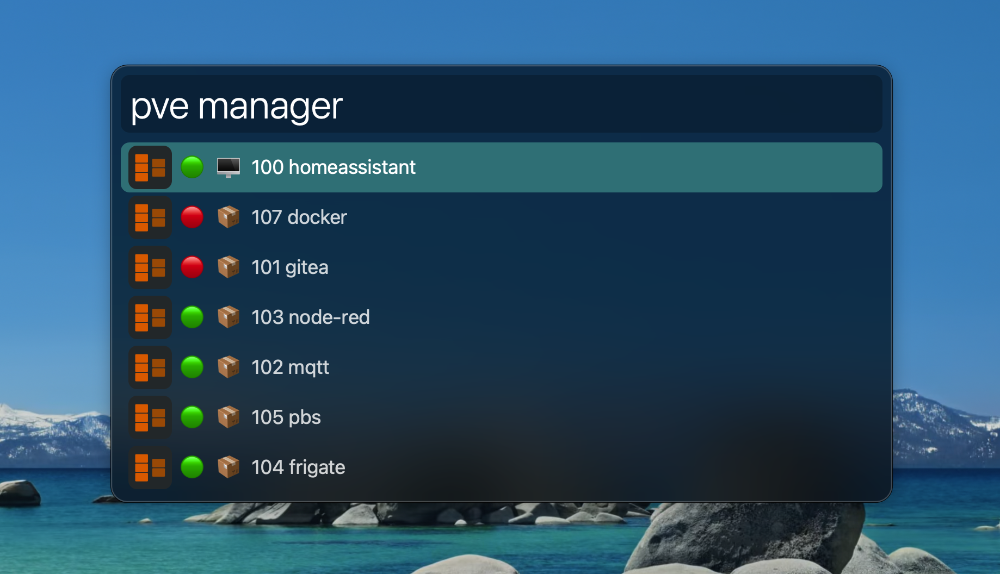
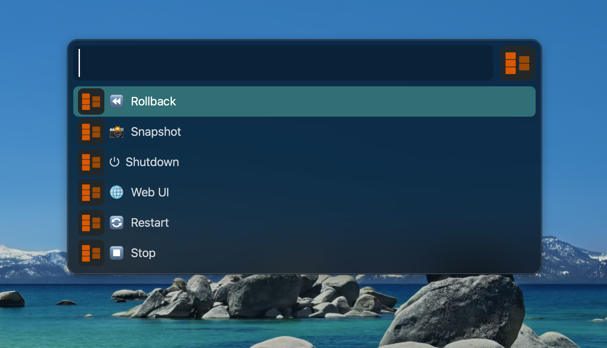
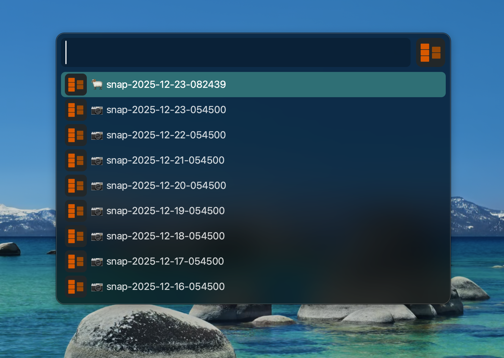
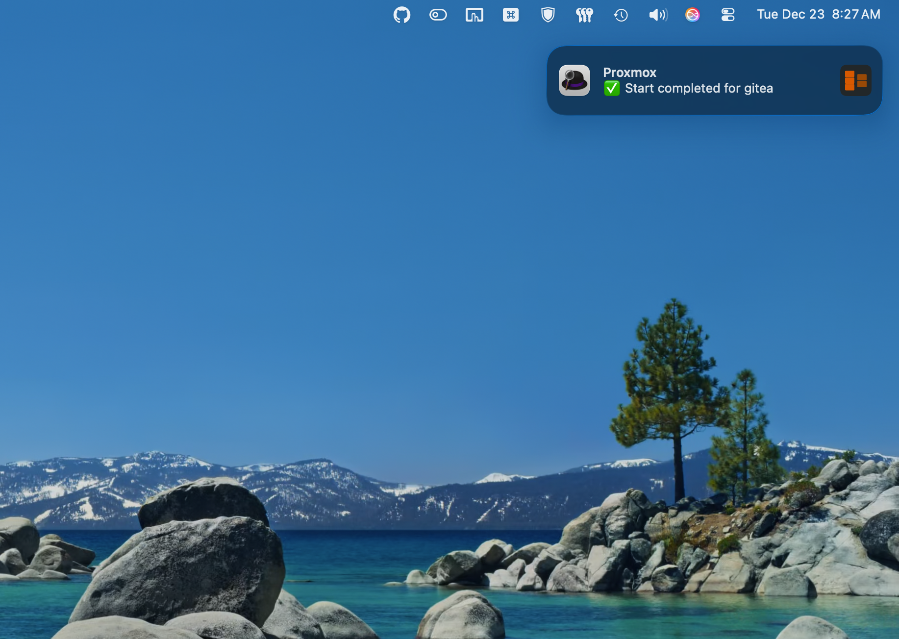
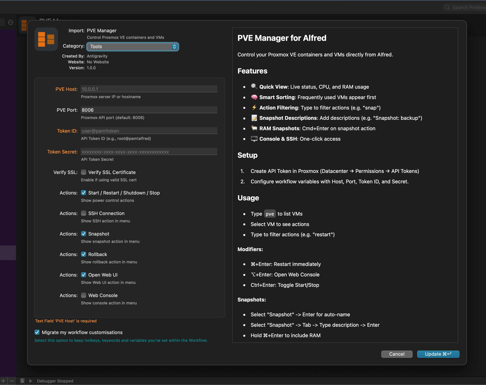

# PVE Manager for Alfred

Control your Proxmox VE containers and VMs directly from Alfred. 

## Features

- 🔍 **Quick View** - See all VMs and containers with live status, CPU, and RAM usage
- 🧠 **Smart Sorting** - Learns which VMs and actions you use most and puts them at the top
- ⚡ **Action Filtering** - Type to filter actions (e.g., type "snap" to find snapshot)
- 📝 **Snapshot Descriptions** - Add custom descriptions to your snapshots
- 🐏 **RAM Snapshots** - Include RAM state in snapshots with `Cmd+Enter`
- ⏪ **Rollback** - Restore any VM/container to a previous snapshot
- 🖥️ **Console & SSH** - Quick access to Web Console or SSH terminal
- 🔔 **Real-time Notifications** - Get notified when tasks start, finish, or fail
- 🔄 **Power Control** - Start, Stop, Shutdown, Restart, Reboot

## Installation

1. Download [PVE-Manager.alfredworkflow](https://github.com/DiggingForDinos/pve_manager/releases/latest)
2. Double-click to install in Alfred

## Setup

### Step 1: Create Proxmox API Token

1. Log into your Proxmox web interface
2. Go to **Datacenter → Permissions → API Tokens**
3. Click **Add**
4. Select your user (e.g., `root@pam`)
5. Enter a Token ID (e.g., `alfred`)
6. **Uncheck** "Privilege Separation" (or grant appropriate permissions)
7. Click **Add**
8. **Copy the Token Secret immediately** - it won't be shown again!

Your Token ID will be: `user@pam!token`

### Step 2: Configure the Workflow

1. Open Alfred Preferences → Workflows
2. Select "PVE Manager"
3. Click the **[x]** button in the top right to configure
4. Fill in:
   - **PVE Host**: Your Proxmox IP (e.g., `10.0.0.1`)
   - **PVE Port**: Usually `8006`
   - **Token ID**: e.g., `user@pam!token`
   - **Token Secret**: The secret you copied earlier
   - **Verify SSL**: Leave unchecked unless you have a valid SSL cert

## Usage

### Listing VMs
Type `pve` to see all VMs and containers. The list is sorted by your usage frequency.

| Result Modifiers | Action |
|------------------|--------|
| **Enter** | Open **Action Menu** for the selected VM |
| **⌘+Enter** | **Restart** immediately |
| **⌥+Enter** | Open **Console** in browser |
| **Shift+Enter** | Graceful **Shutdown** |
| **Ctrl+Enter** | Toggle State (**Start/Stop**) |

### Action Menu
Once you select a VM, you'll see a list of available actions (Start, Stop, Snapshot, etc.).
- **Type to Filter**: Just start typing to find an action (e.g., "res" for restart).
- **Usage Based**: Your most frequent actions appear at the top.

### Snapshots
- **Standard**: Select "Snapshot" and hit Enter to create an auto-named snapshot (`snapN`).
- **With Description**: Select "Snapshot" (or type "snap") and press **Tab**. Then type your description (e.g., `Snapshot: backup before update`) and hit Enter.
- **With RAM**: Hold **⌘ (Cmd)** while pressing Enter on any snapshot action to include RAM/VM State.

### Actions Reference

- **▶️ Start** - Power on the VM/CT
- **⏹️ Stop** - Force stop (like pulling the plug)
- **⏻ Shutdown** - Graceful shutdown (requires ACPI)
- **🔄 Restart** - Reboot the system
- **📸 Snapshot** - Create backup snapshot
- **⏪ Rollback** - Rollback to a previous snapshot
- **🖥️ Console** - Open Proxmox NoVNC console
- **🌐 Web UI** - Open VM details in Proxmox Web UI
- **🔗 SSH** - Open Terminal and SSH to `root@<hostname>`

### Rollback
Select "Rollback" from the action menu to see a list of available snapshots for the selected VM/container.
- **Sorted by Date**: Most recent snapshots appear first
- **Snapshot Info**: Shows date, description, and 🐏 indicator if RAM state is included
- **Auto-Restart**: If the VM was running and the snapshot doesn't include RAM state, it will automatically restart after rollback

## Screenshots

## Troubleshooting

### "Error connecting to Proxmox"
- Check that your Proxmox host is reachable
- Verify the IP and port are correct
- Make sure the API token has the right permissions

### "API Error 401"
- Your token credentials are incorrect
- Check that the Token ID includes the full format: `user@realm!tokenname`

### "API Error 403"
- The API token doesn't have permission for this action
- Try creating a token without privilege separation

## Support & Issues

Found a bug or have a feature request? Please submit an issue on [GitHub](https://github.com/DiggingForDinos/pve_manager/issues).

If you find this workflow helpful, please consider giving the repository a ⭐ star!
